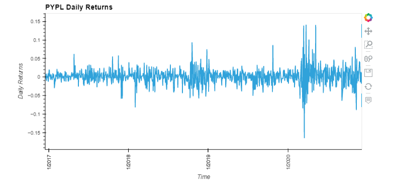
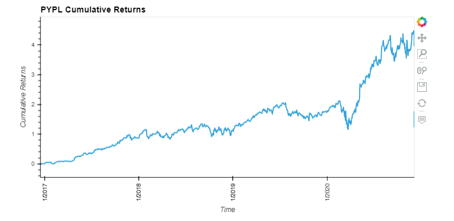
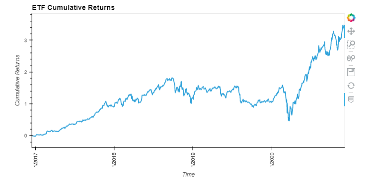
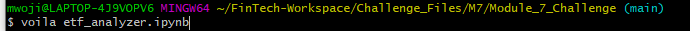
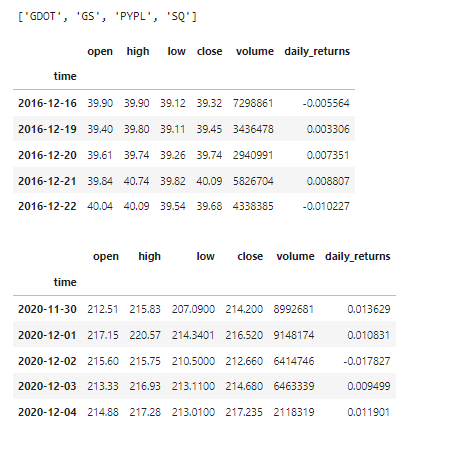
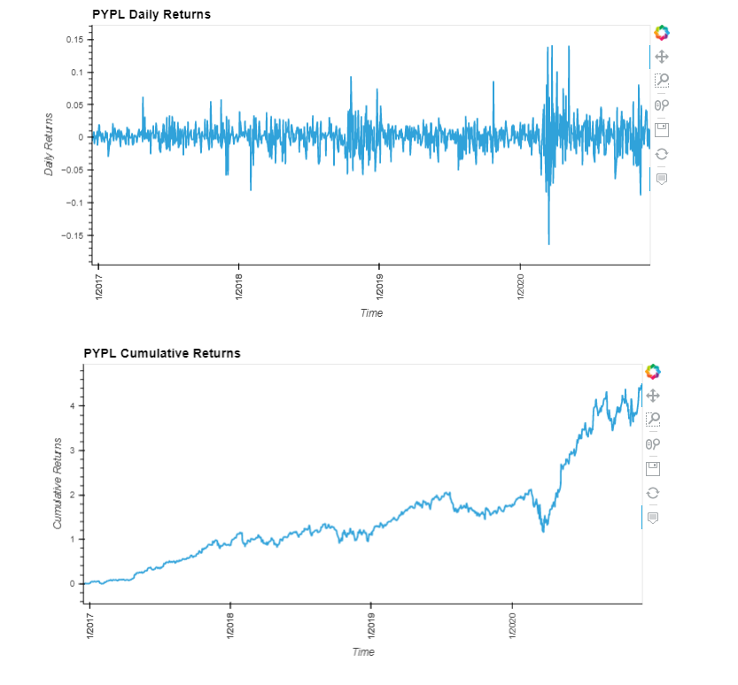
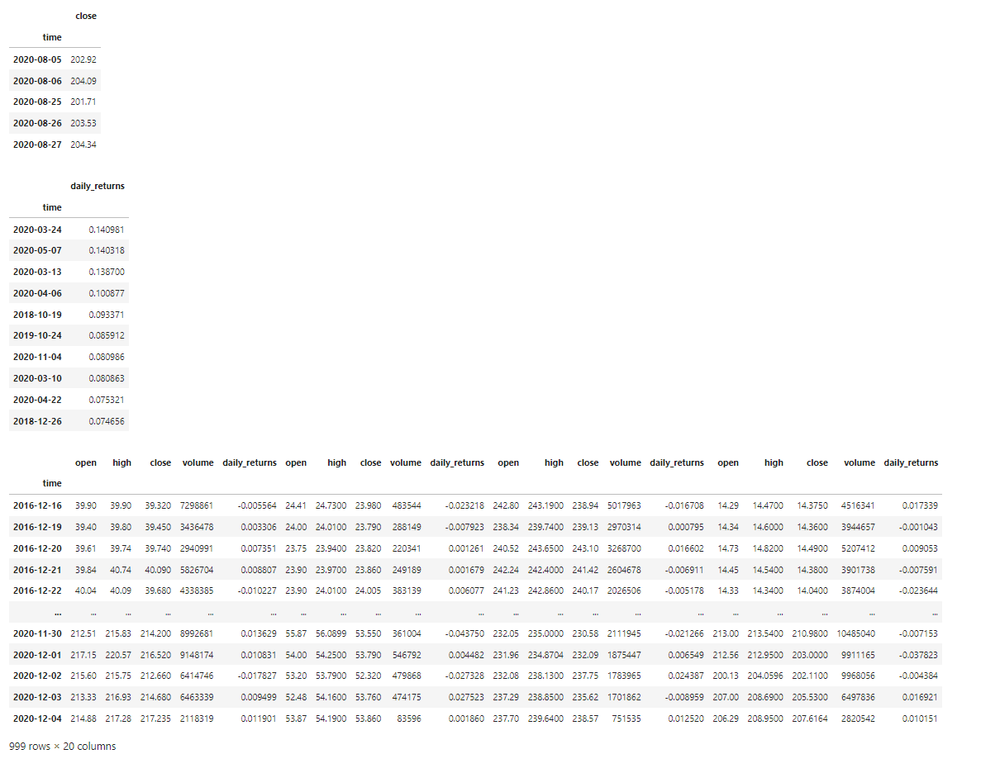
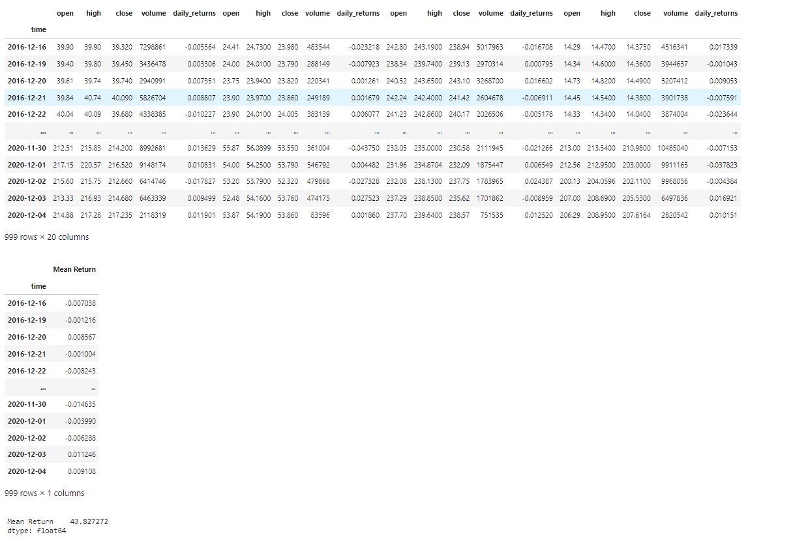
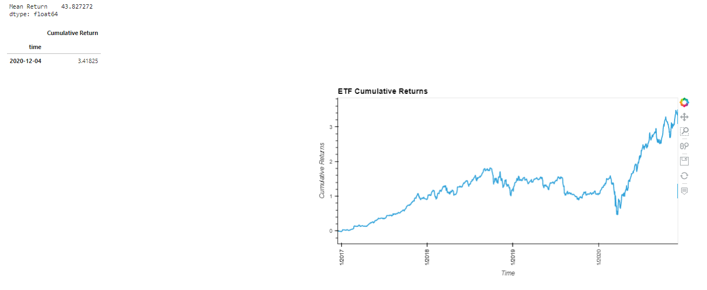

# ETF Analyzer

The goal of this project was to analyze various stocks and their potential combination in an ETF by using SQL to read and order data from a database.

---


## Technologies

This program utilizes Python 3.7 with the following packages:

- [Pandas](https://pandas.pydata.org/) to analyze and manipulate data
- [hvplot](https://hvplot.holoviz.org/) to create interactive data visualizations
- [Path](https://docs.python.org/3.7/library/pathlib.html) to load files from a file path
- [sqlalchemy](https://www.sqlalchemy.org/) to facilitate the communication between Python and data in a database

---

## Process

By conducting SQL queries, I was able to obtain data for four stocks and place them in a SQL table. The first example below is for PYPL where I then generated a dataframe for PYPL trading data and an interactive line plot for visualization of daily returns:

```python
  query = f""" 
    SELECT * from PYPL
    """
    
pypl_dataframe = pd.read_sql_query(query, con=engine)
pypl_dataframe['time'] = pd.to_datetime(pypl_dataframe['time'])
pypl_dataframe = pypl_dataframe.set_index('time')
```




I was also able to generate cumulative returns using the cumprod() function in pandas:




I was then able to use SQL to return a new dataframe where PYPL's closing price was greater than 200:

```python
query = """
    SELECT time, close from PYPL
    WHERE close > 200
    """
```


And a SQL query for the top 10 daily returns for PYPL by using the DESC and LIMIT parameters:

```python
query = """
    SELECT time, daily_returns from PYPL
    ORDER BY daily_returns DESC
    LIMIT 10
    """
```


Finally, I combined all four stocks into one dataframe to begin analyzing a potential equal-weighted ETF:

```python
query = """
    SELECT 
        PYPL.time, PYPL.open, PYPL.high, PYPL.close, PYPL.volume, PYPL.daily_returns,
        GDOT.open, GDOT.high, GDOT.close, GDOT.volume, GDOT.daily_returns,
        GS.open, GS.high, GS.close, GS.volume, GS.daily_returns,
        SQ.open, SQ.high, SQ.close, SQ.volume, SQ.daily_returns
    FROM PYPL
    INNER JOIN GDOT ON GDOT.time = PYPL.time
    INNER JOIN GS ON GS.time = PYPL.time
    INNER JOIN SQ ON SQ.time = PYPL.time
"""
etf_portfolio = pd.read_sql_query(query, con=engine)
etf_portfolio['time'] = pd.to_datetime(etf_portfolio['time'])
etf_portfolio = etf_portfolio.set_index('time')

etf_portfolio_returns = pd.DataFrame(
    data = etf_portfolio['daily_returns'].mean(axis=1),
    columns = ['Mean Return']
)
```


By annualizing the mean return for the new dataframe, I obtained an annualized return of **43.8%.**


Charting the cumulative return for this ETF in hvplot, we also see strong growth over a long time-horizon:




---

## Web Application

To provide an even stronger display for this analysis, I used Viola in gitbash to view the output of this notebook as a web application. Below is a screenshot of this output:













---

## Contributors

This project was created by Matt Wojichowski with the guidance of the University of Washington 2021-2022 FinTech Bootcamp Class.

[Matt Wojichowski LinkedIn](https://www.linkedin.com/in/matt-wojichowski-cfa-caia-93a34a42/)

---

## License

MIT